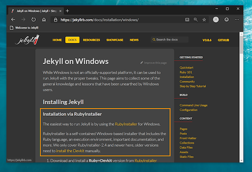
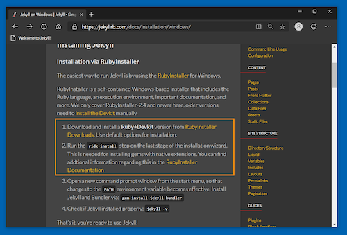
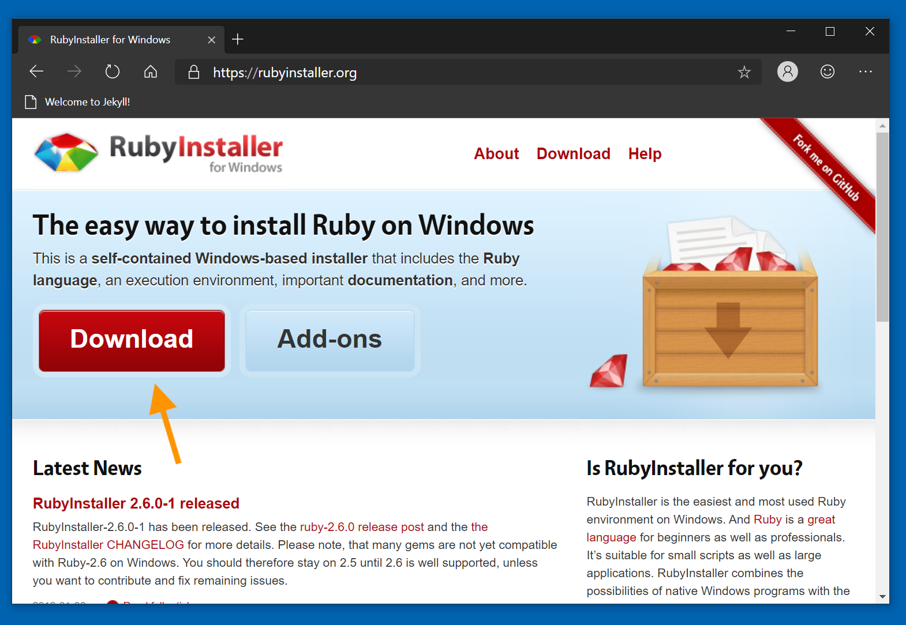
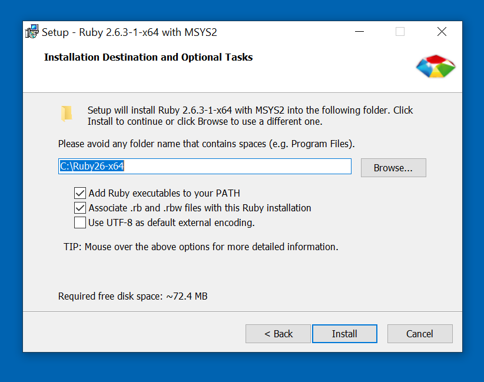
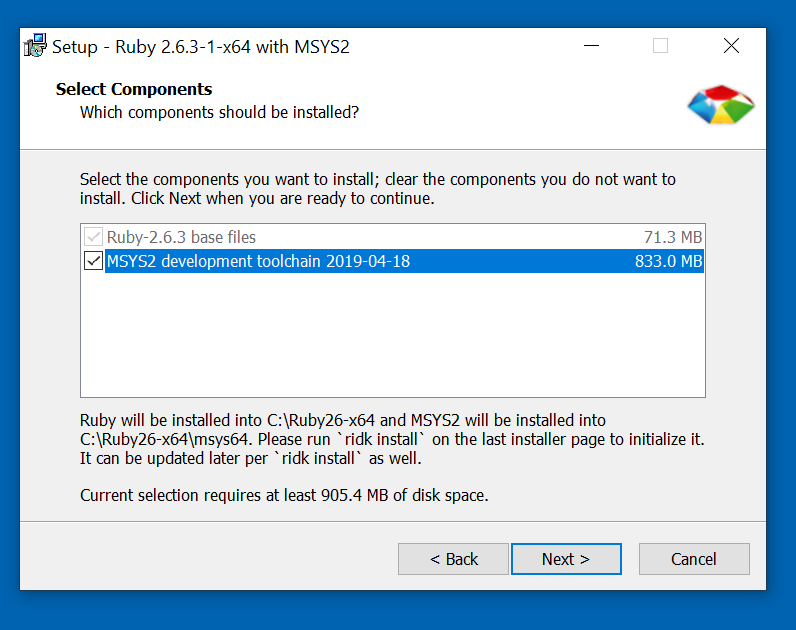
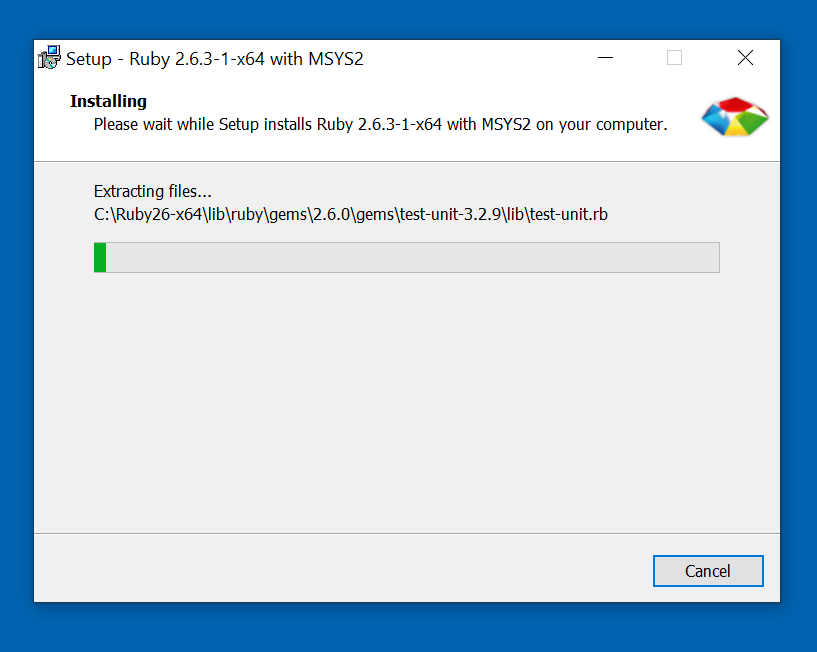
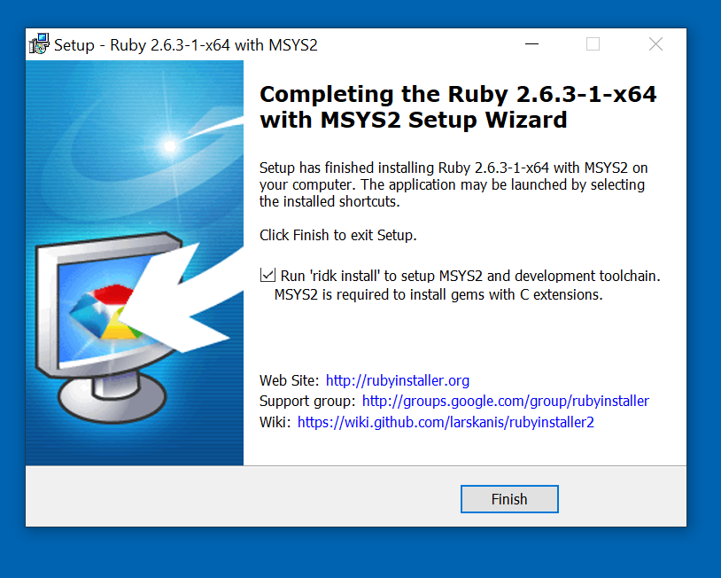
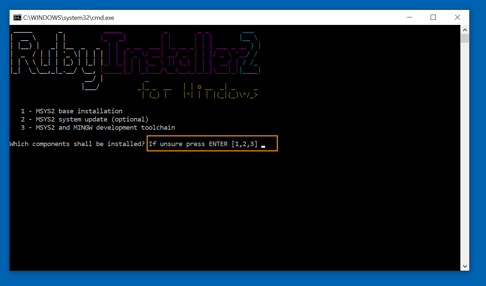
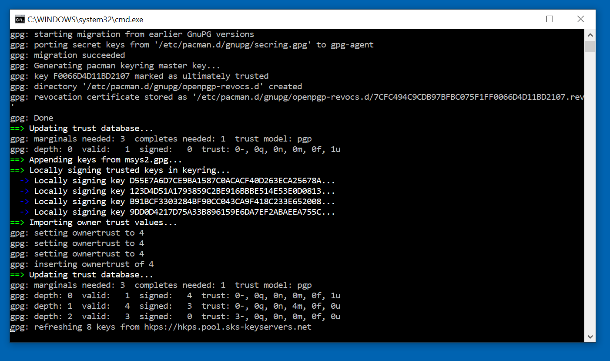

# Installing Ruby on Windows

To be able to run jekyll pages, you will need to install ruby. Mainly so you can install their package bundler. 

*Note these instructions are for windows specifically, if you are using another OS, [log an issue on the course](https://github.com/ToiOhomaiBCS/COMP5210-Course-Material/issues/new)*.

So first open up a browser and go to the [jekyll installation page](https://jekyllrb.com/docs/installation/windows/).

Click on the first orange link that says: **RubyInstaller**

When you have downloaded the setup file and you are going to install it, make sure you select the options according to the screenshots below.

